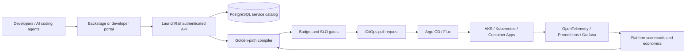

# AI-Native Internal Developer Platform

## Platform Engineering, Backstage, Kubernetes, Azure, Terraform, Crossplane, GitOps, Argo CD, DevSecOps, SRE, FinOps, MLOps and Developer Experience

**LaunchRail** is a production-oriented internal developer platform control plane. It converts a validated service intent into a versioned golden-path plan with infrastructure, delivery, observability, SLO, cost and production gates.

```text
service intent → authenticated platform API → persistent catalog
→ golden-path compiler → budget gate → immutable plan receipt
→ GitOps change → environment validation → approved promotion
```

> **Production claim boundary:** the API and deployment contracts implement production controls, but this repository has not been accepted into a specific organization's production environment. Production acceptance requires configured OIDC, managed PostgreSQL, external secrets, signed images, load testing, backup restoration, failover drills and on-call ownership.

## The painful, urgent and frequent problem

AI coding tools generate code faster than organizations can safely provision infrastructure, establish ownership, build pipelines, configure observability and operate services. Without an internal platform, every team reconstructs these foundations and platform engineers become ticket processors.

LaunchRail standardizes four high-demand golden paths:

- REST API
- Event-driven microservice
- AI agent service
- Real-time data product

It treats developers, data engineers and AI agents as platform customers while keeping production mutation behind deterministic gates.

## Architecture



## Executable production control plane

The FastAPI service exposes:

- `POST /v1/services` — idempotent service-intent submission
- `GET /v1/services` — persistent service catalog
- `GET /v1/services/{id}/plan` — deterministic golden-path plan
- `GET /health/live` — process liveness
- `GET /health/ready` — database readiness
- `GET /metrics` — Prometheus metrics

Example request:

```bash
curl -X POST http://localhost:8080/v1/services \
  -H 'Content-Type: application/json' \
  -H 'Idempotency-Key: invoice-service-request-001' \
  -d '{
    "name":"invoice-reconciliation",
    "owner":"finance-platform",
    "service_type":"event-driven",
    "runtime":"python",
    "data_classification":"confidential",
    "availability_target":99.95,
    "monthly_budget_usd":1200,
    "region":"westeurope"
  }'
```

The response persists a service record and returns a SHA-256 plan receipt. Replaying the same idempotency key returns the same service. No request applies infrastructure automatically.

## Production controls implemented

- OIDC issuer, audience, signature and role validation
- PostgreSQL production persistence
- Explicit SQL migration
- Database-backed idempotency constraint
- Deterministic receipts
- Budget rejection before persistence
- Production startup rejection for SQLite
- Production startup rejection for disabled authentication
- Production rejection of automatic schema mutation
- Health probes and Prometheus metrics
- Non-root, read-only multi-stage container
- Three replicas with rolling update and topology spreading
- Horizontal Pod Autoscaler
- Pod Disruption Budget
- Default-deny NetworkPolicy
- GitOps self-healing with destructive pruning disabled
- SLO and incident runbook

Read the complete [production-readiness contract](docs/production-readiness.md).

## Run locally

```bash
python3 -m venv .venv
.venv/bin/pip install -r requirements-dev.txt
.venv/bin/pytest

docker compose up --build
```

The local profile uses PostgreSQL with authentication disabled only for local development. Production mode refuses that configuration.

## Golden-path compiler

### REST API

Containerized API, PostgreSQL, OpenAPI, managed identity, private evidence storage, CI, SBOM, progressive delivery, rollback and SLO.

### Event-driven microservice

Messaging, AsyncAPI, transactional outbox, dead-letter handling, consumer SLO, idempotency and replay boundaries.

### AI agent service

Foundry/provider contract, MCP tools, trace collection, evaluation gates, token economics and human approval.

### Data product

Event ingestion, lakehouse, data contract, lineage, freshness SLO, data-quality gate and BI consumption path.

## Kubernetes, GitOps and Azure

The Kubernetes baseline contains:

- hardened API deployment;
- service account without automatic token mounting;
- service and probes;
- HPA and PDB;
- zone-aware topology spreading;
- restrictive ingress and egress policy.

The Argo CD application enables self-healing but deliberately disables automatic pruning. The Azure Bicep module creates Application Insights, Log Analytics, ACR, Key Vault and private receipt storage. It compiles independently and does not deploy AKS or paid application workloads automatically.

Target Azure integrations include Azure Deployment Environments, Azure Developer CLI, AKS, Container Apps, Azure Policy, Microsoft Entra ID, Azure DevOps and GitHub.

## Platform unit economics

```bash
python3 tools/evaluate_economics.py \
  examples/platform-business-case.json \
  --output generated/platform-business-case
```

The business case measures:

- time to first deployment and production;
- engineering setup hours per service;
- platform tickets per service;
- environment waste;
- cost per production-ready service;
- cost per successful deployment;
- self-service completion rate;
- golden-path adoption;
- change failure rate and recovery time;
- cloud cost per successful business transaction.

Recovered engineering capacity is not labeled as cash savings. Environment savings require actual deletion and invoice reconciliation. See the generated [platform economics report](generated/platform-business-case/platform-economics.md).

## Why AI-native platform engineering matters

AI agents can propose template improvements, dependency upgrades and migration pull requests. They cannot publish a golden path or mutate production directly.

```text
runtime evidence or developer feedback
→ agent-proposed template change
→ ephemeral environment
→ build, security, performance, cost and rollback tests
→ evidence-bearing pull request
→ platform-owner approval
→ versioned catalog release
```

Every incident and delivery failure can become a regression fixture that improves every future service.

## CI acceptance

The workflow runs:

- API, compiler, persistence and configuration tests;
- production-invariant tests;
- deterministic platform-economics generation;
- generated-evidence drift check;
- Python compilation;
- production container build.

Current local verification: **12 tests passed**, Python compiled, Kubernetes and Argo YAML parsed, Azure Bicep compiled, and economics receipt `4c7adbc7bfeb6e61d7d9ff89133bdde055775e798fcec22e8a9ff0d72c6dd188` reproduced. The local Docker daemon was unavailable, so the container build remains a required GitHub Actions gate rather than a claimed local result.

The transparent first-order business case is intentionally not forced positive: `$207,900` modeled annual capacity/waste value against `$240,000` platform operating cost gives a `-$32,100` first-order net result. It shows that platform investment must also prove launch acceleration, incident reduction, retention or a lower operating model instead of relying on inflated developer-productivity claims.

## Repository map

```text
platform_api/                  FastAPI control plane, OIDC, persistence and compiler
migrations/                    explicit PostgreSQL schema
kubernetes/base/               hardened HA runtime contracts
gitops/                        Argo CD application
infra/azure/                   compilable Azure foundation
examples/                      platform business case
generated/                     deterministic economics evidence
docs/                          production, SLO and search evidence
tests/                         API and production-invariant tests
```

## Search and international-role positioning

The project uses broad current category terms: Platform Engineering, Internal Developer Platform, IDP, Developer Portal, Backstage, Developer Experience, DevOps, DevSecOps, SRE, Kubernetes, Azure, Terraform, OpenTofu, Crossplane, GitOps, Argo CD, Flux, GitHub Actions, Azure DevOps, Infrastructure as Code, Golden Paths, Self-Service Infrastructure, FinOps, OpenTelemetry, AI Platform, AI Agents and MLOps.

Exact search-volume figures are not claimed without proprietary tooling. Every term maps to implementation or a disclosed integration boundary in [search positioning](docs/search-positioning.md).

## Roadmap to environment acceptance

- Backstage frontend plugin and software catalog synchronization
- GitHub App for repository vending and evidence-bearing pull requests
- Azure Deployment Environments catalog adapter
- Crossplane and OpenTofu environment providers
- Entra ID integration and key-rotation acceptance test
- External Secrets and Key Vault integration
- PostgreSQL backup and restore drill
- image signing, SBOM attestation and admission enforcement
- load, soak, zone-failure and database-failover tests
- OpenTelemetry traces and platform adoption dashboard
- automatic but bounded template fleet upgrades

## Work with A2Z SOC

Building or modernizing an engineering platform? **[Request a Platform Engineering and Developer Experience Assessment](https://a2zsoc.com)** covering Azure, Kubernetes, Backstage, GitOps, golden paths, AI-assisted delivery, SRE, FinOps and production readiness.
